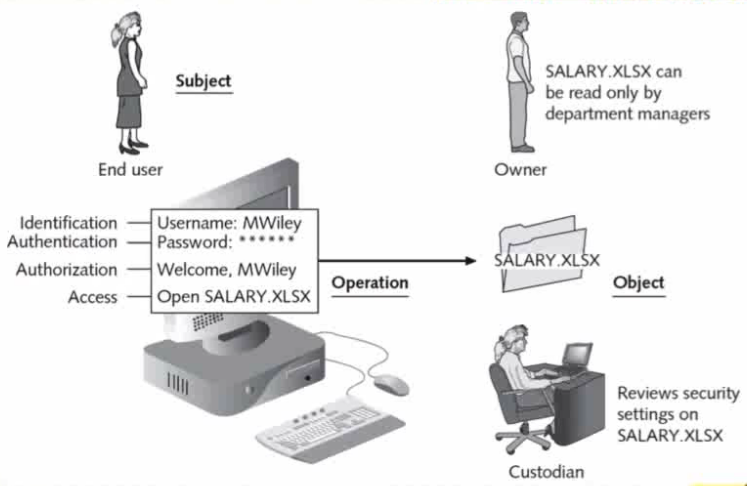

# Identity & Access Management Concepts

**What Is Access Control?**

* Granting or denying approval to use specific resources.
* Information system's mechanism to allow or restrict access to data or devices.
* Four standard models.
* Specific practices used to enforce access control.

**IAM - Identity & Access Management**  
**Identity & Authentication**

* Identification
  * First Step
  * Subject provides identification info - unique to the subject.
  * Username, User ID, Account \#
* Authentication
  * Verifying the identification info.
  * Proving ID
  * Password/Phrase, PIN, Fingerprint, Smart Card
* Authorization
  * What the subject is allowed to see or do.
  * Determining the operations a subject may perform on an object.
  * Permissions.
* Auditing / Accounting
  * Record of events.
  * Logs

**Access Control Terminology**

* _Object_
  * Specified resource.
  * Ex: File or hardware device.
* _Subject_
  * User or process functioning on behalf of a user.
  * Ex: Computer user.
* _Operation_
  * Action taken by the subject over an object.
  * Ex: Deleting a file.

**Authentication Factors**

* Something you know, such as a password or PIN.
* Something you have, such as a smartcard, token, or identification device.
* Something you are, such as your fingerprints or retinal pattern \(biometrics\).
* Something you do, such as an action you must take to complete authentication.
* Somewhere you are \(geolocation\).
* Single Factor \(SFA\)
  * One type.
  * Traditionally a password.
* Multi-Factor Authentication \(MFA\)
  * Uses two or more access methods.
  * Factors should not be in the same category.
* Mutual Authentication - each party validates the other's identity.

**Biometrics**

* Type III - Something you are.
* Metrics related to human characteristics or body measurements.
* Examples:
  * Fingerprint
  * Face
  * Voice
  * Eye
    * _Retina Scan_ - examines the unique pattern of blood vessels at the back of an individual's eye via a beam projected into the eye to capture the pattern.
    * _Iris Scan_ - uses mathematical pattern-recognition techniques on photos taken of an individual's eye. 

**Biometric Errors**

* False Acceptance Rate \(FAR\)
  * When the system accepts an intruder who should be rejected.
* False Rejection Rate \(FRR\)
  * When the system rejects an authorized users.
* Cross-Over Error Rate \(CER\)
  * Metric for comparing biometric systems.
  * The point where FAR and FRR are equal.

**Federation / Federated Identity**

* The means of linking a person's electronic identity and attributes, sorted across multiple distinct identity management systems.
* Means of linking a user's ID with their privileges in a manner that can be used across business boundaries.
* Allows a user to have a single ID that they can use across different businesses.
* Examples: Google, FB, Microsoft

**Single Sign-On \(SSO\)**

* Allows a user to authenticate one time and then access resources in the environment without needing to re-authenticate.
* Different from password synchronization.
* Vulnerability - if an attacker uncovers a user's credentials, they will have access to all that user's resources.
* May also be a single point of failure.

**Transitive Access / Trust**

**Authentication Credentials**

* What you know.
  * User logging into a system.

    * Asked to ID themself:
      * Enters username.
    * Asked to authenticate:
      * Enters password.

  * Passwords are the most common type of authentication today.
  * Passwords only provide weak protection.
* What you have.
* What you are.

